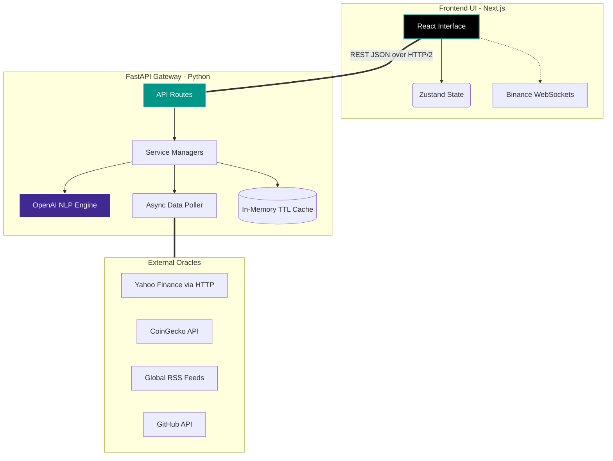

<div align="center">
  
  
  <h1 align="center">Oracle-X Financial Intelligence Terminal</h1>

  <p align="center">
    <strong>A Zero-Latency, Unified Command Center for Equities & Digital Assets.</strong><br>
    <em>Converging traditional quantitative finance with blockchain analytics, powered by Local-First AI semantic extraction.</em>
  </p>

  <p align="center">
    <a href="#core-architecture"></a>
    <a href="#tech-stack"></a>
    <a href="#llm-integration"></a>
    <a href="#blockchain-verification"></a>
    <br/>
    
    
    
    
  </p>
</div>

<details>
  <summary>📚 Table of Contents</summary>
  <ol>
    <li><a href="#the-vision">The Vision</a></li>
    <li><a href="#core-capabilities">Core Capabilities</a></li>
    <li><a href="#system-architecture">System Architecture</a></li>
    <li><a href="#directory-structure">Directory Structure</a></li>
    <li><a href="#tech-stack-deep-dive">Tech Stack Deep-Dive</a></li>
    <li><a href="#rapid-deployment-strategy">Rapid Deployment Strategy</a></li>
    <li><a href="#environment-configuration">Environment Configuration</a></li>
    <li><a href="#core-api-architecture">Core API Architecture</a></li>
    <li><a href="#the-road-ahead">The Road Ahead</a></li>
    <li><a href="#contributing">Contributing</a></li>
  </ol>
</details>

---

## The Vision

Modern traders, quantitative analysts, and financial researchers are forced into extreme context-switching. You use Bloomberg/Reuters for equities, CoinGecko/Glassnode for crypto, TradingView for raw charts, and X/Reddit for sentiment. This fragmented workflow introduces latency in decision-making.

**Oracle-X** eliminates the noise. It is an open-source, extensible intelligence terminal that aggregates multi-trillion dollar asset classes into a single pane of glass. By leveraging real-time WebSockets, Background Task Scheduling, and Large Language Models, Oracle-X doesn't just display data—it contextualizes it. We aim to build the most advanced, free-to-use alternative to institutional trading terminals.

---

## Core Capabilities

### 1. Cross-Asset Market Matrix
Oracle-X breaks down the historic barrier between Wall Street and Web3 natively.
* **Equities (NASDAQ/NYSE):** Direct ingestion of live market caps, forward P/E ratios, analyst target bounds, margins, and free cash flow metrics using Yahoo Finance HTTP Modules.
* **Digital Assets:** Real-time Binance WebSocket bindings. Tracks Layer 1s, DeFi protocols, and Web3 infrastructure with millisecond latency via CoinGecko V3 APIs.
* **The "Deep Dive" Modal:** A premium, glassmorphism UI modal that instantly surfaces over 30+ specific data points per asset. View an equity's debt-to-equity ratio or a crypto protocol's trailing 4-week GitHub commit volume in one click, without navigating away from your charts.

### 2. LLM-Powered Semantic News Engine
Standard keyword matching (regex) for financial news triggers massive false positives. We built an AI ingestion engine.
* **The Ingestion Pipeline:** A custom `APScheduler` asynchronously polls global RSS feeds (Bloomberg, Yahoo Finance, CoinTelegraph) every 5 minutes in a non-blocking thread.
* **Semantic Ticker Extraction:** We pipe raw HTML bodies into OpenAI's `gpt-4o-mini` via massive concurrent pools (`asyncio.gather`). The AI understands nuance to accurately map news to specific tickers (e.g., mapping "Zuckerberg's new VR headset" to `$META` and `$AAPL` competition).
* **Sentiment Scoring:** The algorithmic model assigns Bullish, Bearish, or Neutral weights with an associated confidence score (0-100), instantly quantifying narrative impact before market reaction.

### 3. Visual Market Heatmap
A fluid, interactive SVG/Canvas visualization mapping the entire ecosystem.
* **Dynamic Node Sizing:** Assets scale proportionally based on their exact Market Capitalization weighting.
* **Sector Clustering:** Assets are dynamically grouped by macro sectors (e.g., Layer 2 Scaling, Automotive, Healthcare, AI).
* **Color Kinetics:** Smooth D3-style gradients shift from deep crimson to bright emerald reflecting micro-fluctuations in 24-hour volume and price action. Built purely on React without heavy chart JS bloated libraries.

### 4. Alternative Data Vectors
Oracle-X ingests the non-traditional data that hedge funds pay millions for:
* **Fear & Greed Index Synchronization:** Real-time macro emotional states mapped across the UI.
* **Developer Velocity (Crypto):** Direct GitHub API integrations to chart repository stars, total open/closed issues, and 4-week commit velocity. This allows you to map raw engineering effort directly to token price.
* **Social Graph:** Reddit subscriber velocity, Telegram member tracking, and Twitter follower growth metrics.

---

## System Architecture

Oracle-X operates on a strictly decoupled front-to-back architecture, engineered for high throughput, massive simultaneous API polling, and zero UI blocking.



---

## 📁 Directory Structure

Understanding the monolithic separation is crucial for contributing. The codebase is strictly typed and modular.

### Backend Directory (FastAPI)
```text
oracle-x/backend/
├── main.py                     # ASGI application entry point, CORS config, router injection
├── pyproject.toml              # (If using Poetry) Dependency management
├── requirements.txt            # System pip dependencies
├── .env                        # Environment variables (Ignored in Git)
├── api/
│   ├── routes.py               # All FastAPI endpoints (@app.get) mapped here
│   └── dependencies.py         # Auth, DB, and Rate Limit dependency injections
├── core/
│   ├── config.py               # Pydantic BaseSettings for ENVs
│   └── scheduler.py            # APScheduler config for background RSS polling
├── models/
│   ├── schemas.py              # Pydantic validation models (Input/Output definitions)
│   └── database.py             # (Upcoming) SQLAlchemy ORM tables
├── services/
│   ├── llm_service.py          # OpenAI integration, prompt engineering, semantic routing
│   ├── news_service.py         # RSS parsing via feedparser, BeautifulSoup HTML cleaning
│   ├── stock_market_service.py # Yahoo Finance HTTP scraping logic
│   ├── crypto_market_service.py# CoinGecko/Binance logic
│   └── asset_detail_service.py # Massive data aggregator for the UI Detail Modal
└── utils/
    ├── http_client.py          # Singleton httpx.AsyncClient configuration
    └── cache.py                # TTL and LRU caching decorators
```

### Frontend Directory (Next.js 14)
```text
oracle-x/frontend/
├── next.config.mjs             # Next.js build and SWC compiler settings
├── tailwind.config.ts          # Advanced UI token system, custom hex colors
├── tsconfig.json               # Strict TypeScript compilation rules
├── app/
│   ├── layout.tsx              # Root HTML/Body injection, Global font (Inter)
│   ├── page.tsx                # Main Dashboard composition
│   └── globals.css             # Tailwind @apply directives, CSS variables
├── components/
│   ├── ui/                     # Reusable primitive components (Buttons, Inputs)
│   ├── overview/               
│   │   ├── AdvancedHeatmap.tsx # D3/SVG Recharts Heatmap logic
│   │   ├── AssetDetailModal.tsx# The massive 40-stat detail modal element
│   │   └── MarketOverview.tsx  # Top ticker carousels
│   ├── NewsFeed.tsx            # Left Panel - Rendering LLM scored news articles
│   ├── ChartPanel.tsx          # Middle Panel - Core TradingView iframe injection
│   └── OraclePanel.tsx         # Right Panel - Agentic AI chat UI
├── lib/
│   ├── api.ts                  # Axios configuration, API typed fetchers
│   └── utils.ts                # cn() class merge, formatting utilities
└── store/
    └── useStore.ts             # Zustand global state atom definition
```

---

## Tech Stack Deep-Dive

### The UI Layer (Next.js 14 App Router)
* **Framework:** Builds are optimized using the SWC rust compiler. Server Component architecture ensures lightweight client bundles.
* **State Management (`Zustand`):** Context API causes total DOM re-renders. Zustand allows us to bind real-time WebSocket price updates to atomic components (like a specific ticker price) without affecting the massive Heatmap component.
* **Styling (`Tailwind CSS`):** We strictly avoid UI component libraries (no MUI/Chakra) to maintain extreme rendering performance and exact pixel-perfect control over our Dark Mode glassmorphism UI.

### The API Engine (FastAPI & Python 3.10+)
* **Asynchronous IO:** The entire backend is built on `async def`. Blocking network calls (like Yahoo Finance HTTP requests) are routed through `httpx.AsyncClient` or dispatched to thread pools via `concurrent.futures.ThreadPoolExecutor` ensuring the event loop never blocks.
* **Validation (`Pydantic`):** Every JSON payload moving between Frontend and Backend is enforced via strict Python typing mechanisms.
* **The Brain (`OpenAI gpt-4o-mini`):** We use the mini model to balance immense semantic capabilities with cost-efficiency for processing hundreds of RSS articles hourly.

---

## 🚀 Rapid Deployment Strategy

Oracle-X can run entirely locally on a MacBook, Windows PC, or Ubuntu Server.

### System Prerequisites
| Requirement | Minimum Version | Notes |
|-------------|----------------|-------|
| Node.js | v18.17.0 | Required for Next.js 14 |
| Python | v3.9.0 | v3.10+ highly recommended for modern `asyncio` |
| npm / yarn | Latest | Package management |
| Git | Latest | For cloning the repo |

### ⚡ The 1-Click Boot (Recommended)
We've unified the launch sequence into a single resilient shell script that provisions virtual environments, installs UI dependencies, and boots both servers concurrently in the same terminal instance.

```bash
# 1. Clone the intelligence matrix
git clone https://github.com/yourusername/oracle-x.git
cd oracle-x

# 2. Make the boot sequence executable
chmod +x start.sh

# 3. Ignite the servers
./start.sh
```

### 🛠 Manual Infrastructure Standup

**1. Booting the Intelligence Engine (Backend):**
```bash
cd backend

# Provision isolated Python environment
python3 -m venv .venv
source .venv/bin/activate

# Install the neuro-network dependencies
pip install -r requirements.txt

# Launch ASGI Gateway (Hot-reload enabled)
uvicorn main:app --reload --host 0.0.0.0 --port 8000
```
*Health Check & Swagger Documentation UI natively available at: `http://localhost:8000/docs`*

**2. Booting the Interface (Frontend):**
```bash
cd frontend

# Install exact UI dependencies
npm install

# Build & Serve locally
npm run dev
```
*Access the Web Terminal at: `http://localhost:3000`*

---

## Environment Configuration

To unlock the full potential of Oracle-X (specifically the AI semantic news engine and advanced API rate limits), you must configure environment variables.

Create a `.env` file in the `/backend` directory:

```env
# Required for Semantic News Extraction & AI Analysis
OPENAI_API_KEY="sk-proj-YOUR_OPENAI_KEY_HERE"

# (Optional) For bypassing public rate limits on crypto data
COINGECKO_API_KEY="CG-YOUR_KEY_HERE"

# (Optional) Upcoming Database Integration
SUPABASE_URL="https://your-project.supabase.co"
SUPABASE_KEY="your-anon-key"
```

*Note: If `OPENAI_API_KEY` is omitted, the backend gracefully degradation falls back to basic regex ticker matching for the news feed, though accuracy drops significantly.*

---

## 🔌 Core API Architecture

Oracle-X operates as a fully Headless Data Provider. Quantitative traders can plug custom internal bots or python scripts directly into our FastAPI endpoints locally without even opening the UI.

### Live Endpoint Matrix
All payloads return `application/json`.

| Endpoint | Method | Response Payload & Logic |
|----------|--------|-----------------|
| `/api/market/overview` | `GET` | Aggregates global indices, top cryptocurrencies, and trending lists via massive concurrent fetching. |
| `/api/nasdaq-overview` | `GET` | Scrapes and caches live metrics for the 'Magnificent 7' and core equities. |
| `/api/asset-detail/{ticker}` | `GET` | Intelligent resolver combining CoinGecko ID mapping and Yahoo Finance `quoteSummary` HTTP modules. Returns 40+ dynamic fields. |
| `/api/news` | `GET` | Returns an array of articles scored by `Bullish/Bearish` weights with pre-extracted ticker symbols mapped via LLM. |
| `/api/market/fear-greed` | `GET` | Fetches integer state index (`0-100`) and sentiment string categorization. |
| `/api/market/heatmap` | `GET` | Outputs nested JSON specifically structured for D3.js/Recharts treemap consumption. |

### API Request Example (Python Bot)
```python
import httpx

# Fetch detailed AI-analyzed NVIDIA data locally
r = httpx.get("http://localhost:8000/api/asset-detail/NVDA")
data = r.json()

print(f"Forward P/E: {data['forward_pe']}")
print(f"Target High: {data['target_high_price']}")
print(f"Analyst Rec: {data['recommendation']}")
```

---

## The Road Ahead

We are actively executing the roadmap towards **v2.0**.

- [x] **v0.5 (Foundation):** Dark-mode premium layout, UI component scaffolding, Next.js routing.
- [x] **v1.0 (Data Convergence):** Integration of true real-time wrappers (CoinGecko, Yahoo Finance `quoteSummary`), caching layer implementation.
- [x] **v1.2 (AI Genesis):** Activation of the `gpt-4o-mini` semantic extraction pipeline for news, implementation of complex Asset Detail dynamic views and Heatmap algorithms.
- [ ] **v1.5 (Personalization):** Integration of Supabase Auth. enabling persistent user watchlists, portfolio allocation views, and custom dashboard layout saving.
- [ ] **v2.0 (The Oracle):** Deployment of Solidity Oracles. AI price impact probabilities will be committed to Sepolia Testnet for absolute, immutable track-record tracking.

---

## Contributing

We are building the open-source terminal of the future. Whether you are a Rust quant, a React UI wizard, or a Python data scientist, your PRs are welcomed and needed.

**Contribution Guidelines:**
1. **Fork** the Project repository.
2. **Branching:** Create your Feature Branch off `main` (`git checkout -b feature/QuantumAlgorithm`)
3. **Commit Standards:** Use conventional commits. (`git commit -m 'feat(api): add Quantum Pricing Model endpoint'`)
4. **Push:** Push to the Branch (`git push origin feature/QuantumAlgorithm`)
5. **PR:** Open a Pull Request targeting the `main` branch. Provide screenshots if modifying the UI.

Before opening a PR, ensure:
- FastAPI passes `flake8` or `black` formatting checks.
- Next.js successfully compiles without TypeScript `any` errors (`npm run build`).

---

<div align="center">
  <p>Engineered with violent execution and absolute precision.<br>
  <strong>Welcome to Oracle-X.</strong></p>
</div>
