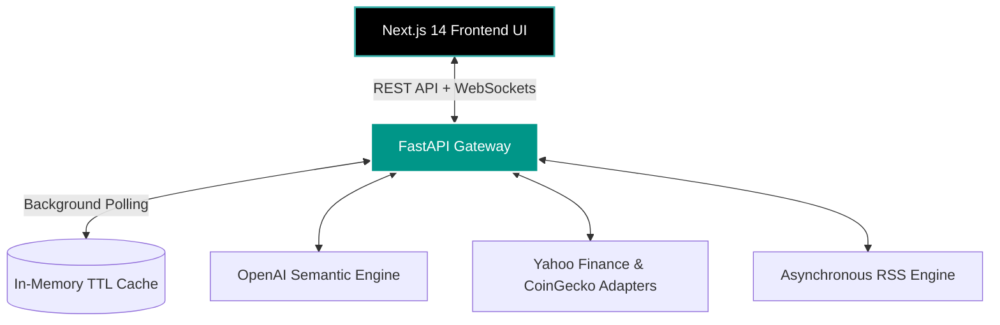

<div align="center">
  
  
  <h1 align="center">Oracle-X Financial Intelligence Terminal</h1>

  <p align="center">
    <strong>A Zero-Latency, Unified Command Center for Equities & Digital Assets.</strong><br>
    <em>Converging traditional quantitative finance with blockchain analytics, powered by Local-First AI semantic extraction.</em>
  </p>

  <p align="center">
    <a href="#core-architecture"></a>
    <a href="#tech-stack"></a>
    <a href="#llm-integration"></a>
    <a href="#blockchain-verification"></a>
    <br/>
    
    
    
  </p>
</div>

---

## 🦅 The Vision

Modern traders and quantitative analysts are forced to context-switch between Bloomberg/Reuters for equities, CoinGecko/Glassnode for crypto, and X/Reddit for sentiment. 

**Oracle-X** eliminates the noise. It is an open-source, extensible intelligence terminal that aggregates multi-trillion dollar asset classes into a single pane of glass. By leveraging real-time WebSockets, Background Task Scheduling, and Large Language Models, Oracle-X doesn't just display data—it contextualizes it.

---

## 🔥 Enterprise-Grade Capabilities

### 1. Cross-Asset Market Matrix
Oracle-X breaks down the barrier between Wall Street and Web3.
* **Equities (NASDAQ/NYSE):** Direct ingestion of live market caps, forward P/E ratios, analyst target bounds, margins, and free cash flow metrics.
* **Digital Assets:** Real-time Binance WebSocket bindings. Tracks Layer 1s, DeFi protocols, and Web3 infrastructure with millisecond latency.
* **The "Deep Dive" Modal:** A premium, glassmorphism UI modal that instantly surfaces 20+ specific data points per asset. View an equity's debt-to-equity ratio or a crypto protocol's trailing 4-week GitHub commit volume in one click.

### 2. LLM-Powered Semantic News Engine
We don't rely on dumb keyword matching. 
* **The Ingestion Pipeline:** A custom `APScheduler` asynchronously polls global RSS feeds (Bloomberg, Yahoo Finance, CoinTelegraph) without blocking the main event loop.
* **Semantic Ticker Extraction:** OpenAI's `gpt-4o-mini` reads every article in background threads, understanding context to accurately map news to specific tickers (e.g., mapping "Zuckerberg announces..." to `META`).
* **Sentiment Scoring:** The AI algorithmically assigns sentiment weights (Bullish/Bearish) to instantly quantify news impact.

### 3. Visual Market Heatmap
A fluid, interactive visualization inspired by Finviz and TradingView.
* **Dynamic Node Sizing:** SVG nodes scale proportionally based on precise Market Capitalization.
* **Sector Clustering:** Assets are dynamically grouped by macro sectors (e.g., Layer 2 Scaling, Automotive, Healthcare).
* **Color Kinetics:** Gradients shift from deep crimson to bright emerald reflecting micro-fluctuations in 24-hour volume and price action.

### 4. Alternative Data Vectors
Oracle-X ingests the data hedge funds pay for:
* **Fear & Greed Synchronization:** Real-time macro emotional states.
* **Developer Velocity:** Direct API integrations to chart GitHub stars, merged Pull Requests, and open issues—allowing you to map engineering effort to token price.
* **Social Graph:** Reddit and Telegram subscriber velocity tracking.

---

## 🏛 Core Architecture

Oracle-X operates on a strictly decoupled front-to-back architecture, engineered for high throughput and zero UI blocking.



### 🧠 The Stack Deep-Dive
* **The UI Layer (Next.js 14 App Router):** Fully typed strictly with TypeScript. Utilizes `Zustand` for lightning-fast atomic state updates without React context re-renders. Styled via `Tailwind CSS`.
* **The API Layer (FastAPI):** Built on Starlette and Pydantic. Leverages `asyncio` and `concurrent.futures.ThreadPoolExecutor` to execute heavy blocking external API calls (HTTPx) without freezing the ASGI event loop.
* **On-Chain Module (In Development):** Hardhat and Solidity smart contracts designed to port AI predictions and sentiment consensuses immutably to the Ethereum Sepolia Testnet.

---

## 🚀 Rapid Deployment Strategy

Oracle-X can run entirely locally on consumer hardware.

### System Prerequisites
* **Runtime Environments:** Node.js (v18.x LTS) & Python (v3.10+)
* **Keys:** OpenAI API Key (Required for the NLP Engine)

### ⚡ The 1-Click Boot (Recommended)
We've unified the launch sequence into a single resilient shell script that provisions virtual environments, installs dependencies, and boots both servers concurrently.

```bash
# Clone the intelligence matrix
git clone https://github.com/yourusername/oracle-x.git
cd oracle-x

# Make the boot sequence executable
chmod +x start.sh

# Ignite the servers
./start.sh
```

### 🛠 Manual Infrastructure Standup

**1. Booting the Intelligence Engine (Backend):**
```bash
cd backend

# Provision isolated Python environment
python3 -m venv .venv
source .venv/bin/activate

# Install the neuro-network dependencies
pip install -r requirements.txt

# Inject API constraints
export OPENAI_API_KEY="sk-proj-..."

# Launch ASGI Gateway (Hot-reload enabled)
uvicorn main:app --reload --host 0.0.0.0 --port 8000
```
*Health Check & Swagger Documentation: `http://localhost:8000/docs`*

**2. Booting the Interface (Frontend):**
```bash
cd frontend

# Install exact UI dependencies
npm install

# Build & Serve locally
npm run dev
```
*Access Terminal at: `http://localhost:3000`*

---

## 📡 API Spec Blueprint

Oracle-X isn't just a UI; it's a headless data provider. You can plug custom trading bots directly into our FastAPI endpoints.

| Route | HTTP | Response Payload & Logic |
|-----------|----------|-----------------|
| `/api/market/overview` | `GET` | Aggregates global indices, top cryptocurrencies, and trending lists. |
| `/api/nasdaq-overview` | `GET` | Scrapes and caches live metrics for the 'Magnificent 7' and core equities. |
| `/api/asset-detail/{ticker}` | `GET` | Intelligent resolver combining CoinGecko ID mapping and Yahoo Finance `quoteSummary` HTTP modules. Returns 40+ dynamic fields. |
| `/api/news` | `GET` | Returns an array of articles scored by `Bullish/Bearish` weights with pre-extracted ticker symbols mapped via LLM. |
| `/api/market/fear-greed` | `GET` | Fetches integer state index (`0-100`) and sentiment string categorization. |
| `/api/market/heatmap` | `GET` | Outputs nested JSON specifically structured for D3.js/Recharts treemap consumption. |

---

## 🌌 The Road Ahead (Oracle-X Roadmap)

We are actively iterating towards v2.0. Join the revolution.

- [x] **v0.5 (Foundation):** Dark-mode premium layout, UI components, Next.js routing.
- [x] **v1.0 (Data Convergence):** Integration of true real-time wrappers (CoinGecko, Yahoo Finance `quoteSummary`), caching layer implementation.
- [x] **v1.2 (AI Genesis):** Activation of the `gpt-4o-mini` semantic extraction pipeline for news, implementation of complex Asset Detail dynamic views.
- [ ] **v1.5 (Personalization):** Integration of Supabase Auth. enabling persistent user watchlists, portfolio allocation views, and custom dashboard layouts.
- [ ] **v2.0 (The Oracle):** Deployment of Solidity Oracles. AI price impact probabilities will be committed to Sepolia for immutable accuracy tracking.

---

## 🤝 Contributing

We are building the open-source terminal of the future. Whether you are a Rust quant, a React UI wizard, or a Python data scientist, your PRs are welcomed. 

1. Fork the Project
2. Create your Feature Branch (`git checkout -b feature/QuantumAlgorithm`)
3. Commit your Changes (`git commit -m 'Add Quantum Pricing Model'`)
4. Push to the Branch (`git push origin feature/QuantumAlgorithm`)
5. Open a Pull Request

---

<div align="center">
  <p>Engineered with violent execution and precision.<br>
  <strong>Welcome to Oracle-X.</strong></p>
</div>
